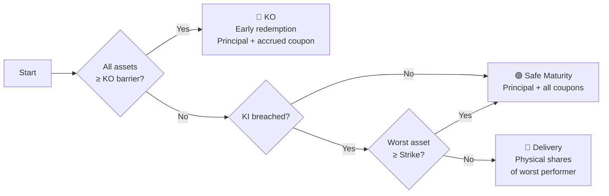

# FCN Pricing Simulation Tool

> **FCN** = Fixed Coupon Note
> Browser-based **Monte Carlo** pricing with live market data from Yahoo Finance.

---

## Quick Start

### Option A — One-click EXE (no Python required)

Double-click **`FCN_Pricing_Tool.exe`** (in `dist/`) → browser opens automatically at `http://127.0.0.1:5000`.

### Option B — Run from source

```bash
pip install -r requirements.txt
python app.py
# Open http://127.0.0.1:5000
```

---

## What Does This Tool Do?

Pricing **Fixed Coupon Notes** — yield-enhancement structured products popular in Asian markets (HK, SG, TW). The tool simulates thousands of correlated stock price paths to estimate:

| Output                          | Description                                          |
| ------------------------------- | ---------------------------------------------------- |
| **Fair Value (%)**        | Present value as % of notional given a coupon rate   |
| **Fair Coupon (%)**       | Equilibrium coupon rate that makes Fair Value = 100% |
| **Avg Duration (Days)**   | Expected holding period                              |
| **Scenario Distribution** | KO by month / Safe Maturity / Delivery breakdown     |
| **Correlation Matrix**    | Pairwise correlations between underlyings            |
| **Delivery Risk**         | Which asset most often causes physical delivery      |

### Two Modes

| Mode                  | Input                    | Output          | Method                  |
| --------------------- | ------------------------ | --------------- | ----------------------- |
| **Fair Value**  | Coupon rate              | Fair Value (%)  | Direct Monte Carlo      |
| **Fair Coupon** | Target FV (default 100%) | Fair Coupon (%) | Bisection + Monte Carlo |

---

## Features

- **Multi-asset basket** — 2+ correlated underlyings with worst-of payoff
- **Live market data** — Yahoo Finance, no API key required
- **Configurable** — tenor, barriers (KO/KI/Strike), KI type (American/European), risk-free rate
- **Correlated GBM** — Cholesky decomposition for proper correlation structure
- **Interactive charts** — Scenario distribution (Chart.js), correlation heatmap (Plotly), delivery risk (Chart.js)
- **Full documentation** — built-in modal with MathJax-rendered methodology
- **Standalone EXE** — PyInstaller bundle for non-technical users

---

## Project Structure

```
FCN-Pricing-Tool/
├── app.py              # Flask backend (Yahoo Finance API proxy)
├── index.html          # Main web UI (Monte Carlo engine in JS)
├── docs.html           # Standalone documentation page
├── requirements.txt    # Python dependencies
├── run_web.bat         # Quick launcher for Windows
├── build_exe.bat       # Rebuild standalone EXE
├── .gitignore
├── dist/
│   └── FCN_Pricing_Tool.exe   # Pre-built standalone executable
└── README.md
```

---

## Parameters Reference

### Underlying Assets

| Param                 | Description                                                    |
| --------------------- | -------------------------------------------------------------- |
| **Tickers**     | Yahoo Finance symbols, comma-separated:`AAPL, MSFT, 0700.HK` |
| **Data Period** | Historical lookback: 6 months / 1 year / 2 years               |

### Product Terms

| Param                       | Range               | Description                                                              |
| --------------------------- | ------------------- | ------------------------------------------------------------------------ |
| **Tenor**             | 1–60 months        | Product maturity                                                         |
| **Annual Coupon**     | 0–100%             | Annualized coupon paid while no KI                                       |
| **Target Fair Value** | 80–120%            | Target PV for fair coupon solving (Mode 2 only)                          |
| **KO Barrier**        | 50–200%            | Knock-out trigger (% of initial); all assets ≥ this → early redemption |
| **KI Barrier**        | 0–100%             | Knock-in trigger; any asset ≤ this → KI event                          |
| **Strike**            | 0–100%             | Delivery strike; KI + worst < Strike → physical shares                  |
| **KO Start**          | 1–24 months        | Month from which KO observation begins                                   |
| **KI Type**           | American / European | Continuous observation vs. at-maturity only                              |

### Simulation

| Param                    | Range     | Description                           |
| ------------------------ | --------- | ------------------------------------- |
| **Risk-Free Rate** | 0–20%    | Annual rate for discounting           |
| **# Simulations**  | 500–100k | Monte Carlo paths (more = less noise) |

---

## Payoff Scenarios

An FCN has three mutually exclusive outcomes, evaluated on the **worst-performing** asset in the basket:

| Scenario | Trigger | Payoff at event time $T$ |
|---|---|---|
| **① Knock-Out** | **All** assets $\ge$ KO barrier on any day after KO Start | $100 \cdot \bigl(1 + c \cdot \frac{T-5}{252}\bigr) \cdot e^{-rT/252}$ |
| **② Safe Maturity** | No KO; and either no KI, or KI but worst $\ge$ Strike | $100 \cdot \bigl(1 + c \cdot \frac{T_{\text{total}}-5}{252}\bigr) \cdot e^{-rT_{\text{total}}/252}$ |
| **③ Delivery** | KI breached **and** worst asset $\lt$ Strike | $\bigl(100c\frac{T_{\text{total}}-5}{252} + 100\frac{S_{\text{worst}}}{\text{Strike}}\bigr) e^{-rT_{\text{total}}/252}$ |

> **American KI**: observed continuously (any day breach). **European KI**: observed at maturity only.  
> **KO observation** begins after KO Start month. Coupon accrues daily while the note is alive.



---

## Methodology (Summary)

1. **Data** — Fetch ~252 daily closes from Yahoo Finance → compute annualized volatility & correlation matrix from log returns.
2. **Simulation** — Correlated Geometric Brownian Motion via Cholesky decomposition:

$$
\Sigma = LL^T, \qquad Z_{\text{corr}} = LZ, \qquad S_i(t+dt) = S_i(t) \cdot \exp\!\Big((r - \tfrac{1}{2}\sigma_i^2)\,dt + \sigma_i\sqrt{dt} \cdot Z_{\text{corr}}[i]\Big)
$$

3. **Payoff** — Evaluate KO/KI barriers daily on the worst-performing asset. Discount all cash flows at the risk-free rate.
4. **Fair Coupon** — Bisection (binary search) on $FV(c)$. Since $FV(c)$ is monotonic in $c$, converge to $c^*$ where $FV(c^*) = 100\\%$ in $\approx 13$ iterations.

Full details: click **📖 Methodology & Documentation** button in the app.

---

## Building the Standalone EXE

```bash
pip install pyinstaller
pyinstaller --onefile --name "FCN_Pricing_Tool" \
    --add-data "index.html;." --add-data "docs.html;." \
    --hidden-import flask --hidden-import flask_cors \
    --hidden-import requests --hidden-import urllib3 \
    --clean app.py
```

Or double-click `build_exe.bat`. Output: `dist/FCN_Pricing_Tool.exe` (~13 MB).

---

## Dependencies

| Package    | Version | Purpose                       |
| ---------- | ------- | ----------------------------- |
| Flask      | ≥3.0   | Web server                    |
| Flask-CORS | ≥4.0   | Cross-origin support          |
| requests   | ≥2.28  | HTTP client for Yahoo Finance |
| urllib3    | ≥2.0   | Connection pooling & retry    |

No API keys required. Stock price data can be directly fetched from `yfinance`.

---

## Limitations

- **GBM assumes constant volatility** — real markets exhibit clustering & regime changes
- **Constant correlation** — correlations spike during crises
- **No jump risk** — plain GBM, no Merton jump-diffusion; tail risk underestimated
- **No dividend yield** — adjusted close prices used; explicit div yields not modeled
- **Daily monitoring** — continuous barriers approximated at daily granularity
- **Monte Carlo noise** — SE ~ O(1/√N); 2000 paths → ~2pp error on probabilities

> **Disclaimer**: Educational purposes only. Not financial advice. Do not rely on for actual trading decisions.

---

## License

MIT